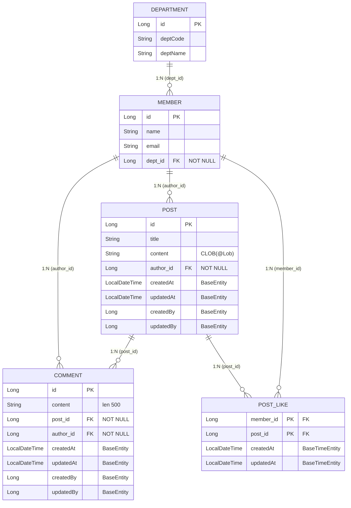

# ERD — 게시판 도메인

현재 도메인 엔티티(`Member`, `Department`, `Post`, `Comment`, `PostLike`)의 관계도.
`base`의 `BaseEntity`/`BaseTimeEntity`는 테이블이 아니라 `@MappedSuperclass`라 별도 엔티티로 그리지 않고,
**상속받은 감사 컬럼만 각 테이블에 표시**한다.

> 관련: 연관관계 설계 `association-mapping-guide.md`, 복합키 `postlike-composite-key-guide.md`,
> 공통 필드(Auditing) `composite-key-guide.md`.

---

## Mermaid



## ASCII (한눈에 보기)

```
                 ┌────────────┐
                 │ DEPARTMENT │
                 └─────┬──────┘
                       │ 1:N (dept_id, NOT NULL)
                 ┌─────▼──────┐
       ┌─────────┤   MEMBER   ├──────────┐
       │ author  └─────┬──────┘  member  │
       │ 1:N           │ author   1:N    │
       │ NOT NULL      │ 1:N             │
 ┌─────▼─────┐   ┌─────▼──────┐   ┌──────▼─────┐
 │  COMMENT  │   │    POST    │   │  POST_LIKE │
 │  post_id  │───┤            ├───┤ (member_id,│
 │  NOT NULL │1:N│            │1:N│  post_id)  │  ← 복합키
 └───────────┘   └────────────┘   └────────────┘
   = Member × Post 연결(좋아요)을 복합키로 푼 테이블
```

---

## 관계 정리

| 관계 | 종류 | FK 컬럼 | 필수 |
|---|---|---|---|
| Member → Department | N:1 | `dept_id` | ✅ NOT NULL |
| Post → Member (작성자) | N:1 | `author_id` | ✅ NOT NULL |
| Comment → Post | N:1 | `post_id` | ✅ NOT NULL |
| Comment → Member (작성자) | N:1 | `author_id` | ✅ NOT NULL |
| PostLike → Member | N:1 | `member_id` (PK 일부) | ✅ (PK) |
| PostLike → Post | N:1 | `post_id` (PK 일부) | ✅ (PK) |

---

## 짚어둘 점

- **모든 연관관계가 단방향**이다 (`mappedBy` 역방향 리스트 없음). 양방향(`Post.comments`, `Department.members` 등)은
  "반대 방향 조회가 실제로 필요해질 때 + cascade 설계 시점"에 추가한다 (→ `association-mapping-guide.md` 4절).
- **모든 FK가 NOT NULL** — 고아 데이터(부서 없는 회원, 작성자 없는 글/댓글)를 DB 레벨에서 차단한다.
  매핑에선 `optional = false`(ORM, LAZY 최적화) + `@JoinColumn(nullable = false)`(DB 제약)를 함께 건다.
- **감사 컬럼 상속 차이:**
  - `Post`, `Comment` → `BaseEntity` 상속 → 시간 2개(`createdAt`/`updatedAt`) + 작성자 2개(`createdBy`/`updatedBy`)
  - `PostLike` → `BaseTimeEntity` 상속 → 시간 2개만 (좋아요엔 "누가 수정"이 의미 없음)
- **`PostLike`는 연결 테이블** — `(member_id, post_id)` 복합키로 "회원 × 게시글 다대다(좋아요)"를 풀고,
  키 제약으로 "한 회원이 한 글에 좋아요 1번"을 강제한다.

---

## 한 줄 요약

> 회원·부서·게시글·댓글·좋아요의 5개 테이블. 모든 관계는 **N:1 단방향 + NOT NULL**,
> 감사 컬럼은 상속(`BaseEntity`/`BaseTimeEntity`)으로, 좋아요는 **복합키 연결 테이블**로 구성.
